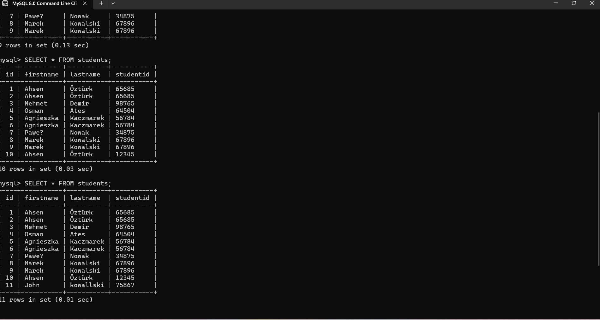
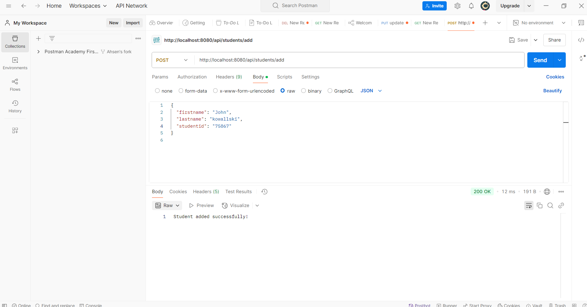

# Student Registration API (Spring Boot + MySQL)

This is a basic Spring Boot REST API that allows users to register students by sending their information in JSON format. The student data is stored in a MySQL database.

## Purpose

The goal of this project is to demonstrate a simple CRUD (Create, Read, Update, Delete) functionality using Spring Boot and JDBC with MySQL. It serves as a learning project for integrating Java applications with relational databases.

## Features

- Add new students with `firstname`, `lastname`, and `studentid`
- Store student data in a MySQL database  
  
- Test the API using Postman  
  

## How to Use

1. Run the Spring Boot application.
2. Send a `POST` request to: http://localhost:8080/api/students/add

